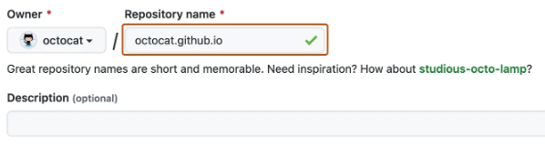
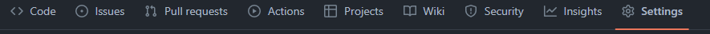
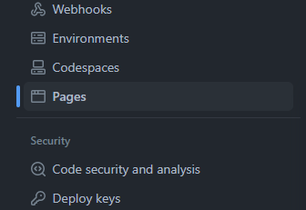
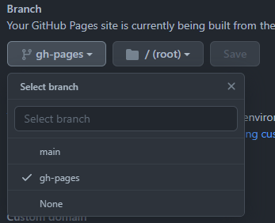

# GHpage-parcel
*création d'une github page avec PARCEL.js et SASS*
## Technos

    

## Procédure

### Installation

1.Créer un nouveau dépôt avec comme nom **VOTRENOM.github.io** exemple :

 [DOC Git Hub Pages](https://docs.github.com/en/pages/quickstart)

2.Copier ce dépôt dans votre nouveau dépôt fraîchement créé.

3.Installer les dépendances avec ``npm install``.

4.Assurez vous d'avoir une branche **gh-pages**.Si ce n'est pas le cas, créez-en une avec la commande``git branch gh-pages``

5.Creer votre contenu et observer les changements avec ``npm start`` le rendu sera fait à cette adresse [http://localhost:1234/](http://localhost:1234/)

### Publication

1.Sur votre dépôt GitHub, allez dans la section **Settings**

Puis, accédez à **Pages** 

Configurez votre **branch** sur **gh-pages**

2. Avec la commande ``npm run deploy``publiez votre contenu

3. Au bout de quelques instants votre site sera en ligne sur [https://VOTRENOM.github.io/]().

### Divers commande

* ``npm start`` : lance notre serveur de développement

*  ``npm run clear`` : efface le répertoire dist et parcel-cache

* ``npm run build``: pour créer votre application pour la production.

* ``npm run deploy``: pour publier votre application.

